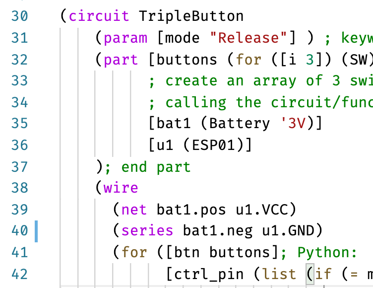

# bhdl-vscode extension

This extension add syntax highlights for BHDL keywords. After installation, edit
a `.rkt` file (e.g. the [`test.bhdl.rkt`](test.bhdl.rkt) in this repo), and you will see syntax highlights for BHDL keywords, like the
image below.



## Installation

To install the extension, download the `.vsix` file (e.g. `bhdl-0.0.1.vsix`) in the [release page](https://github.com/bhdl/bhdl-vscode/releases), and run:

```
code --install-extension bhdl-0.0.1.vsix
```

To remove the extension from your VSCode, you should be able to uninstall it in
VSCode's extension manager.

Please also install the
[`magic-racket`](https://marketplace.visualstudio.com/items?itemName=evzen-wybitul.magic-racket)
extension for regular racket's syntax highlights.

## Development

Generating the `.vsix` file:

```
vsce package
```
